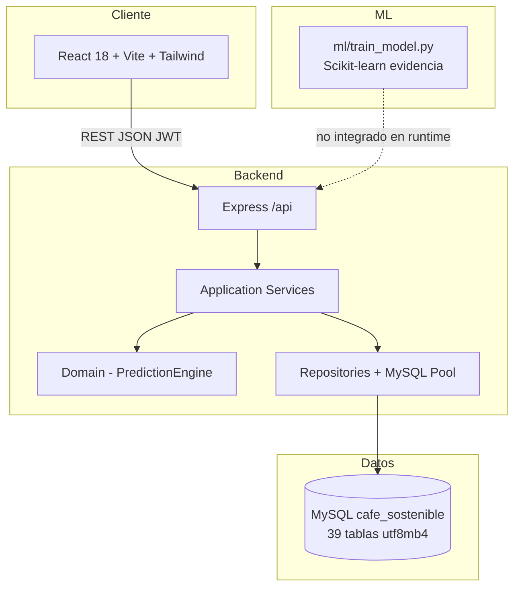
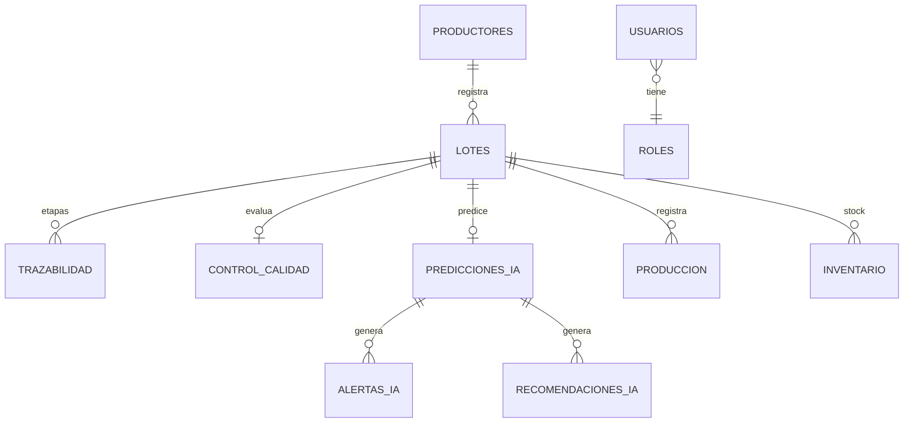

# Auditoría técnica — Café Sostenible AI

**Versión auditada:** PMV2 (mysql-hexagonal-v2.0)  
**Rol:** Software Architect · QA · Tech Lead  
**Fecha:** 2026

---

## 1. Mapa general del sistema

### 1.1 Vista de contenedores



### 1.2 Flujo hexagonal (backend)

```text
HTTP Request
  → interfaces/http/routes/*.routes.js
  → middleware: devOrAuth, validateBody
  → interfaces/http/controllers/*Controller.js
  → application/services/*Service.js
  → domain/PredictionEngine.js (solo IA)
  → infrastructure/repositories/*Repository.js
  → infrastructure/database/pool.js → MySQL
```

**Estado real:** hexagonal **parcial**. Productores, lotes, calidad, trazabilidad, predicciones y dashboard usan Controller → Service → Repository. **Reportes** y **producción** aún tienen SQL en rutas.

### 1.3 Relación entre módulos de negocio



| Módulo | Depende de | Alimenta a |
|--------|------------|------------|
| Productores | Geografía (distrito) | Lotes |
| Lotes (registro) | Productores | Trazabilidad auto, inventario, QR |
| Calidad | Lotes sin evaluación | IA (puntaje opcional), reportes |
| IA | Lotes sin predicción usuario | Alertas, dashboard, reportes |
| Trazabilidad | Lotes | Reportes, vista timeline |
| Dashboard | Agregaciones SQL | KPIs UI |
| Reportes | Todas las tablas anteriores | PDF/Excel export |

---

## 2. Inventario PMV / historias de usuario

### HU implementadas (HU01–HU06)

| ID | Módulo | Estado |
|----|--------|--------|
| HU01 | Productores CRUD | ✅ |
| HU02 | Registro lote/producción | ✅ |
| HU03 | Trazabilidad + QR | ✅ |
| HU04 | Control calidad sensorial | ✅ |
| HU05 | Predicción IA bajo demanda | ✅ |
| HU06 | Reportes + export | ✅ |

### PMV1 vs PMV2 vs PMV3

| Capacidad | PMV1 | PMV2 | PMV3 (objetivo) |
|-----------|------|------|-----------------|
| CRUD + trazabilidad | ✅ | ✅ | ✅ |
| SQLite | ✅ | ❌ MySQL | ✅ |
| JWT | ❌/básico | ✅ | ✅ + RBAC estricto |
| Arquitectura hexagonal | ❌ | ⚠️ parcial | ✅ completa |
| Seed 25 lotes | ❌ | ✅ | ✅ |
| UI SaaS + dark mode | ❌ | ⚠️ parcial | ✅ |
| PDF/Excel | ❌ | ✅ | ✅ |
| ML Python integrado | ❌ | carpeta ml/ | API + modelo |
| Tests E2E | ❌ | 13 unit | 30+ + CI |

### Incompleto / faltante

- RBAC por ruta (`authorize()` definido, no usado)
- Validación frontend conectada en todas las pantallas
- Reportes/Producción sin capa Controller/Repository
- Tablas schema sin uso (fincas, cosechas, evaluaciones_calidad duplicada, dashboard_metricas)
- Integración runtime ML Python ↔ Node
- Tests integración con MySQL / supertest
- Toasts no usados en formularios
- TypeScript / OpenAPI

---

## 3. Hallazgos de auditoría

### ✅ Bien implementado

- MySQL utf8mb4, pool, migración + seed PMV2
- PredictionEngine v2 coherente (riesgo, alertas, factores)
- Separación Controller/Service/Repository en núcleo operativo
- Validators backend + middleware validateBody
- Frontend modular: pages, layouts, context, lazy routes
- Export reportes PDF/Excel
- Documentación README, PMV2, estructura

### ⚠️ Mal estructurado / deuda

- **Dos fuentes de verdad lote:** `lotes` vs `produccion` (HU02 mezcla conceptos)
- **Estado lote:** campo `estado` VARCHAR vs catálogo `estados_lote` / `estado_lote_id` (FK no usada en app)
- **Calidad:** `control_calidad` vs `evaluaciones_calidad` en schema
- **Ruta duplicada:** `/api/evaluaciones` = `/api/control-calidad`
- **Endpoint legacy:** `POST /api/prediccion-ia` + `POST /api/predicciones/ejecutar`
- **IA:** motor heurístico, no modelo entrenado en producción

### Código / archivos sobrantes

| Archivo | Motivo |
|---------|--------|
| `frontend/src/domain/entities.js` | No importado en ninguna página |
| `frontend/src/components/ui/Card.jsx` | No usado (existe KpiCard) |
| `frontend/src/services/api` → `createPrediccion` | POST eliminado en backend |
| `backend/database.LEGACY.md` | Solo referencia histórica (OK doc) |
| `supertest` (devDep) | No hay tests HTTP con supertest |

### Dependencias

- Frontend: todas en uso (recharts, react-qr-code, lucide)
- Backend: exceljs, pdfkit usados en ReportExportService
- ESLint/Prettier declarados; ejecución manual, no en CI

---

## 4. Calificaciones (1–10)

| Área | Nota | Comentario |
|------|------|------------|
| Frontend | **7.5** | Shell PMV2 moderno; páginas internas desiguales |
| Backend | **7.0** | Hexagonal parcial, rutas legacy |
| Base de datos | **8.0** | Schema empresarial; app usa ~40% tablas |
| Arquitectura | **6.5** | Buen diseño, implementación incompleta |
| IA | **6.5** | Reglas sólidas; falta ML productivo |
| UX/UI | **7.5** | Dashboard/layout bien; formularios antiguos |
| Seguridad | **6.0** | JWT sí; RBAC y validación entrada débil en prod |
| Documentación | **7.5** | Buena base; faltan diagramas C4/secuencia |
| QA | **6.0** | Unitarios básicos; sin E2E ni cobertura |
| **Global PMV2** | **7.2** | Proyecto avanzado universitario, pre-empresa |

**Nivel percibido:** Tesis / proyecto integrador avanzado (8–9/10 universitario). Para SaaS comercial faltan CI/CD, RBAC, observabilidad y ML integrado.

---

## 5. Roadmap recomendado

### Urgente (1–2 semanas)

1. Refactor `reportes.routes` + `produccion.routes` → Controller/Repository
2. Aplicar `authorize('admin','supervisor')` en rutas mutantes
3. Conectar `validation.js` + `useToast` en Productores, Registro, Calidad
4. Eliminar código muerto (entities.js, Card.jsx, createPrediccion)
5. Unificar registro lote vs tabla produccion (documentar o fusionar)

### Recomendado PMV2 cierre (2–4 semanas)

6. Usar FKs catálogo (variedad_id, proceso_secado_id) en LoteService
7. Tests integración API con supertest + MySQL test
8. OpenAPI / Swagger `/api/docs`
9. Homogeneizar todas las páginas con PageHeader + card-panel
10. CI GitHub Actions: test + build

### PMV3 (opcional)

11. Microservicio Python FastAPI para inferencia ML
12. WebSockets alertas IA en dashboard
13. Multi-tenant / cooperativas
14. PWA offline finca

---

## 6. Estructura actual (referencia)

Ver [ESTRUCTURA_PROYECTO.md](./ESTRUCTURA_PROYECTO.md) y [PMV2.md](./PMV2.md).
