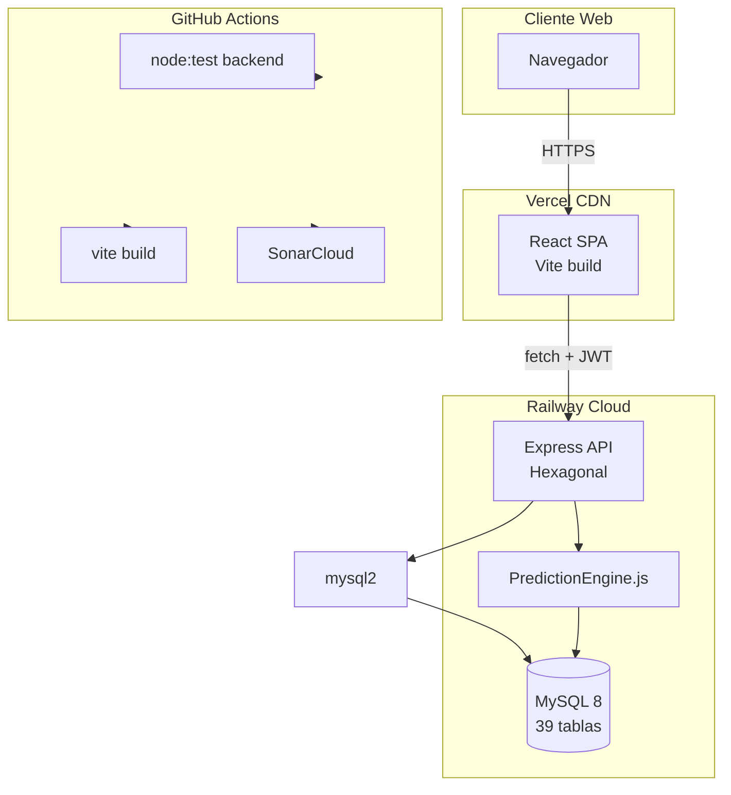

# Arquitectura Tecnológica — CAFE-IA

**Fecha:** 2026-06-24  
**Patrón:** Arquitectura hexagonal · Monorepo npm · Despliegue cloud (Railway + Vercel)

---

## 1. Stack completo

| Capa | Tecnologías verificadas |
|------|-------------------------|
| Presentación | React 18, Vite 5, Tailwind 3, React Router 6, Recharts, lucide-react |
| API | Node.js 20, Express 4, JWT, middleware seguridad |
| Dominio | Servicios hexagonales, PredictionEngine.js, CalidadService |
| Persistencia | mysql2, MySQL 8, 39 tablas InnoDB |
| Infraestructura | Railway (API+BD), Vercel (SPA), GitHub Actions |
| Calidad | Cypress, JMeter, SonarCloud, node:test |
| ML | Heurístico Node (prod) · scikit-learn Python (offline) |

---

## 2. Flujo tecnológico



---

## 3. Integración Frontend ↔ Backend

| Aspecto | Implementación |
|---------|----------------|
| Protocolo | HTTPS REST JSON |
| Cliente HTTP | `fetch` nativo (`services/api/client.js`) — **no Axios** |
| Autenticación | Header `Authorization: Bearer <JWT>` |
| Base URL | `VITE_API_URL` (Vercel) → Railway API |
| Timeout | 8000 ms |
| CORS | Backend permite orígenes Vercel (`*.vercel.app`) y `CORS_ORIGINS` |
| Errores | Clase `ApiError`; handler 401 → logout |
| Módulos API | 13 routers bajo `/api` |

**Flujo login:**
1. `LoginPage` → POST `/api/auth/login`
2. Token en `localStorage` (AuthContext)
3. Peticiones subsiguientes con Bearer token
4. POST `/api/auth/logout` invalida refresh token

---

## 4. Integración con Base de Datos

| Aspecto | Implementación |
|---------|----------------|
| Driver | mysql2/promise con pool |
| Config | Variables `MYSQL*` unificadas (Railway + local) |
| SSL | `MYSQL_SSL=true` en Railway |
| Inicialización | `migrate.js` al arranque (`server.js`) |
| Esquema | `backend/sql/schema.sql` — geografía, seguridad, productores, lotes, trazabilidad, calidad, IA, auditoría |
| Relaciones | FK entre usuarios↔roles, lotes↔productores, trazabilidad↔lotes, etc. |
| Integridad | UNIQUE, índices, `ON DELETE CASCADE` en tablas pivote |
| Seeds | `seeds.sql`, scripts PMV2 en `backend/scripts/` |

**Tablas principales operativas:** `usuarios`, `productores`, `lotes`, `trazabilidad_etapas`, `evaluaciones_calidad`, `predicciones_ia`, `auditoria_logs`, `sesiones`.

---

## 5. Integración con Inteligencia Artificial

### Producción (verificado)

```
ModuloIAPage.jsx
    → POST /api/predicciones/ejecutar { lote_id }
    → PrediccionService
    → PredictionEngine.js (heurístico v2)
    → Lectura datos lote/calidad en MySQL
    → Respuesta: calidad, confianza, riesgo, alertas, recomendaciones
    → Persistencia en tabla predicciones_ia
```

### Académico (offline, no integrado en API)

```
ml/train_model.py
    → pandas lee dataset_cafe.csv
    → RandomForestClassifier (scikit-learn)
    → joblib guarda quality_model.joblib
    → metrics.json
```

**Hallazgo:** La API de producción **no invoca** el modelo Python. Son dos pipelines independientes.

### Chatbot

```
ChatbotIAPage.jsx → POST /api/chatbot
    → ChatbotService + ChatbotDataService
    → Intents sobre datos MySQL (sin LLM externo verificado)
```

---

## 6. Integración Railway y Vercel

### Railway (Backend + MySQL)

| Elemento | Detalle |
|----------|---------|
| Arranque | `npm start` → `server.js` |
| Puerto | `PORT` env (default 3029) |
| Host | `0.0.0.0` (requerido cloud) |
| MySQL | Variables `MYSQLHOST`, `MYSQLPORT`, `MYSQLUSER`, `MYSQLPASSWORD`, `MYSQLDATABASE` |
| Health | GET `/api/health` — usado por JMeter |
| Logs | `[Railway]` prefix en `server.js` |
| Blueprint alt. | `render.yaml` (referencia, no activo principal) |

### Vercel (Frontend)

| Elemento | Detalle |
|----------|---------|
| Framework | Vite detectado |
| Build | `npm run build` → `dist/` |
| SPA routing | Rewrite `/(.*)` → `/index.html` |
| API URL | `VITE_API_URL` en `vercel.json` build env |
| Cache | `no-cache` en `/` e `index.html` |

### GitHub (CI/CD)

| Job | Acción |
|-----|--------|
| backend | `npm test` (SKIP_INTEGRATION=1) |
| frontend | `npm run build` |
| sonarcloud | Análisis post-build |
| dependency-audit | `npm audit` (continue-on-error) |

**Gap:** Cypress no ejecuta en CI.

---

## 7. Tecnologías solicitadas no implementadas

| Tecnología solicitada | Sustituto / Estado |
|----------------------|-------------------|
| Axios | Fetch API nativo |
| SweetAlert2 | ToastContext propio |
| React Icons | lucide-react |
| multer | Sin upload de archivos |
| node-cron | Sin tareas programadas |
| Docker | Sin Dockerfile |
| SonarQube on-prem | SonarCloud (SaaS) |

---

*Arquitectura reconstruida por ingeniería inversa. Ver DER en `der-relaciones-completas.md` (copia en Evidencias).*
