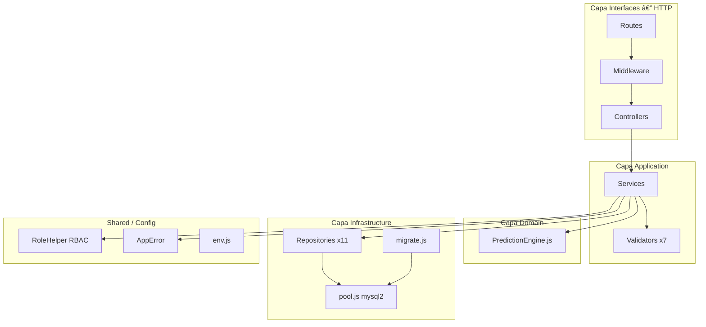

# Diagrama Capas — CAFE-IA

**Fecha:** 2026-06-24

```mermaid
flowchart TB
    subgraph Interfaces["Capa Interfaces — HTTP"]
        Routes[Routes]
        Controllers[Controllers]
        Middleware[Middleware]
    end

    subgraph Application["Capa Application"]
        Services[Services]
        Validators[Validators x7]
    end

    subgraph Domain["Capa Domain"]
        Engine[PredictionEngine.js]
    end

    subgraph Infrastructure["Capa Infrastructure"]
        Repos[Repositories x11]
        Pool[pool.js mysql2]
        Migrate[migrate.js]
    end

    subgraph Shared["Shared / Config"]
        RoleHelper[RoleHelper RBAC]
        AppError[AppError]
        Env[env.js]
    end

    Routes --> Middleware --> Controllers
    Controllers --> Services
    Services --> Validators
    Services --> Engine
    Services --> Repos
    Repos --> Pool
    Migrate --> Pool
    Services --> RoleHelper
    Services --> AppError
```
