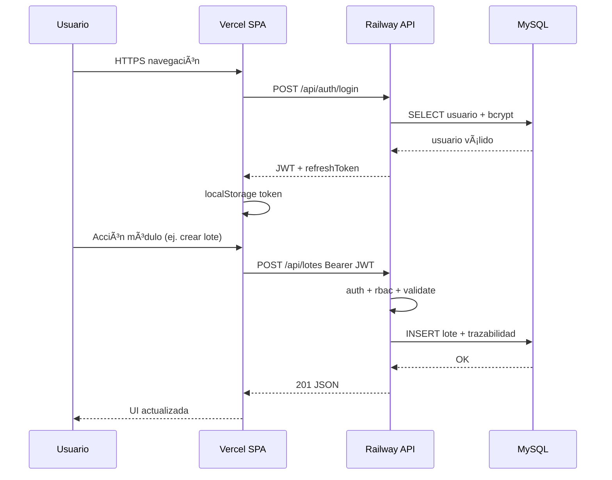

# Diagrama Cliente Servidor — CAFE-IA

**Fecha:** 2026-06-24

```mermaid
sequenceDiagram
    participant U as Usuario
    participant V as Vercel SPA
    participant A as Railway API
    participant M as MySQL

    U->>V: HTTPS navegación
    V->>A: POST /api/auth/login
    A->>M: SELECT usuario + bcrypt
    M-->>A: usuario válido
    A-->>V: JWT + refreshToken
    V->>V: localStorage token

    U->>V: Acción módulo (ej. crear lote)
    V->>A: POST /api/lotes Bearer JWT
    A->>A: auth + rbac + validate
    A->>M: INSERT lote + trazabilidad
    M-->>A: OK
    A-->>V: 201 JSON
    V-->>U: UI actualizada
```
