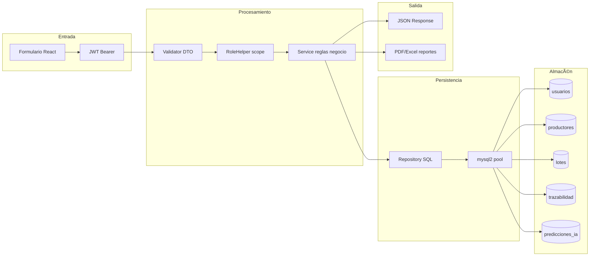

# Diagrama Flujo Datos — CAFE-IA

**Fecha:** 2026-06-24

```mermaid
flowchart LR
    subgraph Input["Entrada"]
        UI[Formulario React]
        JWT[JWT Bearer]
    end

    subgraph Process["Procesamiento"]
        VAL[Validator DTO]
        SVC[Service reglas negocio]
        RBAC[RoleHelper scope]
    end

    subgraph Persist["Persistencia"]
        REPO[Repository SQL]
        POOL[mysql2 pool]
    end

    subgraph Store["Almacén"]
        T1[(usuarios)]
        T2[(productores)]
        T3[(lotes)]
        T4[(trazabilidad)]
        T5[(predicciones_ia)]
    end

    subgraph Output["Salida"]
        JSON[JSON Response]
        PDF[PDF/Excel reportes]
    end

    UI --> JWT --> VAL --> RBAC --> SVC --> REPO --> POOL
    POOL --> T1 & T2 & T3 & T4 & T5
    SVC --> JSON
    SVC --> PDF
```
