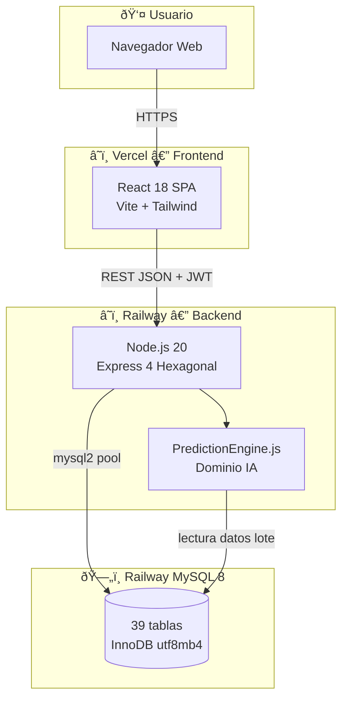

# Diagrama General — CAFE-IA

**Fecha:** 2026-06-24

```mermaid
flowchart TB
    subgraph Usuario["👤 Usuario"]
        Browser[Navegador Web]
    end

    subgraph Vercel["☁️ Vercel — Frontend"]
        SPA[React 18 SPA<br/>Vite + Tailwind]
    end

    subgraph Railway["☁️ Railway — Backend"]
        API[Node.js 20<br/>Express 4 Hexagonal]
        IA[PredictionEngine.js<br/>Dominio IA]
    end

    subgraph Data["🗄️ Railway MySQL 8"]
        DB[(39 tablas<br/>InnoDB utf8mb4)]
    end

    Browser -->|HTTPS| SPA
    SPA -->|REST JSON + JWT| API
    API --> IA
    API -->|mysql2 pool| DB
    IA -->|lectura datos lote| DB
```
