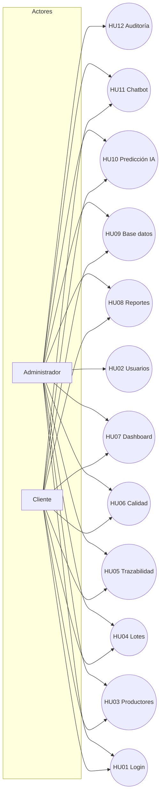

# Casos de Uso — CAFE-IA (HU01–HU12)

```mermaid
flowchart LR
    subgraph Actores
        A1[Administrador]
        A2[Cliente]
    end

    UC01((HU01 Login))
    UC02((HU02 Usuarios))
    UC03((HU03 Productores))
    UC04((HU04 Lotes))
    UC05((HU05 Trazabilidad))
    UC06((HU06 Calidad))
    UC07((HU07 Dashboard))
    UC08((HU08 Reportes))
    UC09((HU09 Base datos))
    UC10((HU10 Predicción IA))
    UC11((HU11 Chatbot))
    UC12((HU12 Auditoría))

    A1 --> UC01 & UC02 & UC03 & UC04 & UC05 & UC06 & UC07 & UC08 & UC09 & UC10 & UC11 & UC12
    A2 --> UC01 & UC03 & UC04 & UC05 & UC06 & UC07 & UC08 & UC09 & UC10 & UC11
```
