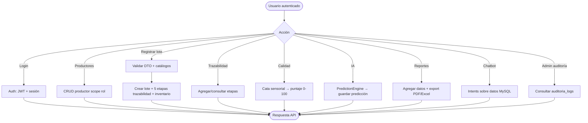

# Flujo de Procesos — CAFE-IA

```mermaid
flowchart TD
    Start([Usuario autenticado]) --> A{Acción}
    A -->|Login| P1[Auth: JWT + sesión]
    A -->|Productores| P2[CRUD productor scope rol]
    A -->|Registrar lote| P3[Validar DTO + catálogos]
    P3 --> P4[Crear lote + 5 etapas trazabilidad + inventario]
    A -->|Trazabilidad| P5[Agregar/consultar etapas]
    A -->|Calidad| P6[Cata sensorial → puntaje 0-100]
    A -->|IA| P7[PredictionEngine → guardar predicción]
    A -->|Reportes| P8[Agregar datos + export PDF/Excel]
    A -->|Chatbot| P9[Intents sobre datos MySQL]
    A -->|Admin auditoría| P10[Consultar auditoria_logs]
    P1 --> End([Respuesta API])
    P2 --> End
    P4 --> End
    P5 --> End
    P6 --> End
    P7 --> End
    P8 --> End
    P9 --> End
    P10 --> End
```
