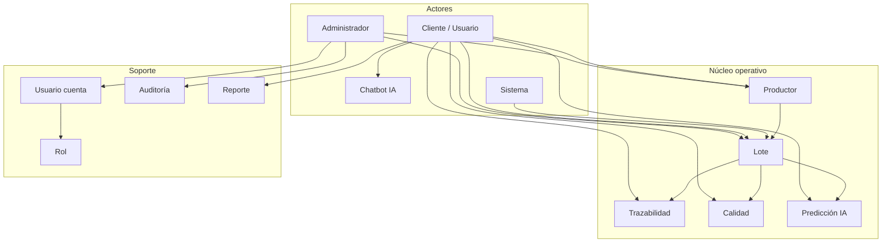

# Modelo Conceptual — CAFE-IA

```mermaid
flowchart TB
    subgraph Actores["Actores"]
        ADM[Administrador]
        CLI[Cliente / Usuario]
        BOT[Chatbot IA]
        SYS[Sistema]
    end

    subgraph Core["Núcleo operativo"]
        PROD[Productor]
        LOTE[Lote]
        TRAZ[Trazabilidad]
        CAL[Calidad]
        IA[Predicción IA]
    end

    subgraph Soporte["Soporte"]
        USR[Usuario cuenta]
        ROL[Rol]
        AUD[Auditoría]
        REP[Reporte]
    end

    ADM --> USR & PROD & LOTE & AUD
    CLI --> PROD & LOTE & TRAZ & CAL & IA & REP
    CLI --> BOT
    SYS --> LOTE
    PROD --> LOTE
    LOTE --> TRAZ & CAL & IA
    USR --> ROL
```
