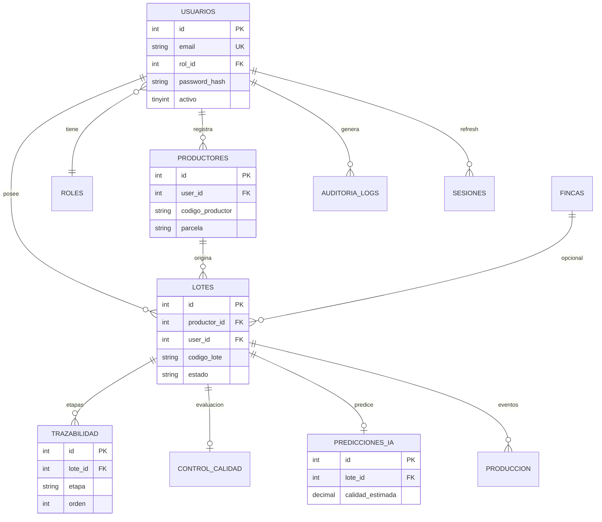

# Modelo de Dominio — CAFE-IA

```mermaid
erDiagram
    USUARIOS ||--o{ PRODUCTORES : registra
    USUARIOS ||--o{ LOTES : posee
    USUARIOS }o--|| ROLES : tiene
    PRODUCTORES ||--o{ LOTES : origina
    FINCAS ||--o{ LOTES : opcional
    LOTES ||--o{ TRAZABILIDAD : etapas
    LOTES ||--o| CONTROL_CALIDAD : evaluacion
    LOTES ||--o| PREDICCIONES_IA : predice
    LOTES ||--o{ PRODUCCION : eventos
    USUARIOS ||--o{ AUDITORIA_LOGS : genera
    USUARIOS ||--o{ SESIONES : refresh

    USUARIOS {
        int id PK
        string email UK
        int rol_id FK
        string password_hash
        tinyint activo
    }
    PRODUCTORES {
        int id PK
        int user_id FK
        string codigo_productor
        string parcela
    }
    LOTES {
        int id PK
        int productor_id FK
        int user_id FK
        string codigo_lote
        string estado
    }
    TRAZABILIDAD {
        int id PK
        int lote_id FK
        string etapa
        int orden
    }
    PREDICCIONES_IA {
        int id PK
        int lote_id FK
        decimal calidad_estimada
    }
```
