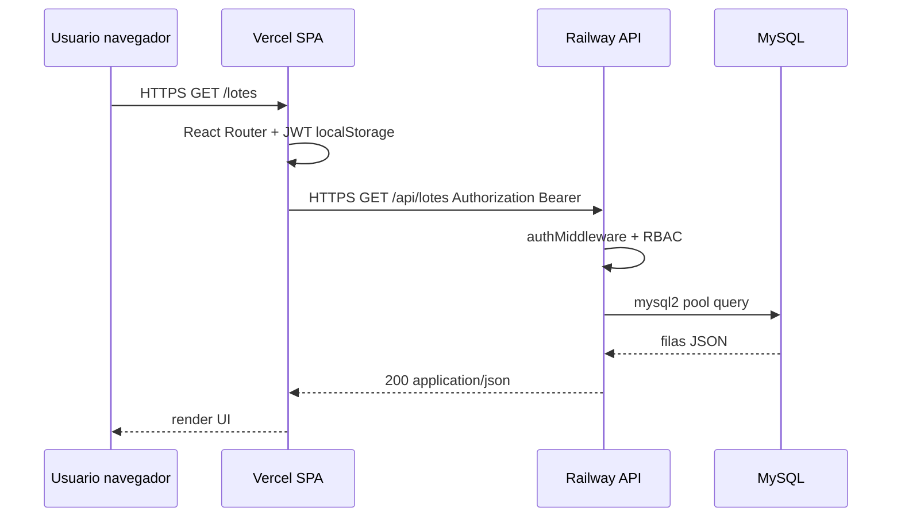

# Diagrama Cliente-Servidor — CAFE-IA

```mermaid
sequenceDiagram
    participant U as Usuario navegador
    participant V as Vercel SPA
    participant A as Railway API
    participant M as MySQL

    U->>V: HTTPS GET /lotes
    V->>V: React Router + JWT localStorage
    V->>A: HTTPS GET /api/lotes Authorization Bearer
    A->>A: authMiddleware + RBAC
    A->>M: mysql2 pool query
    M-->>A: filas JSON
    A-->>V: 200 application/json
    V-->>U: render UI
```
