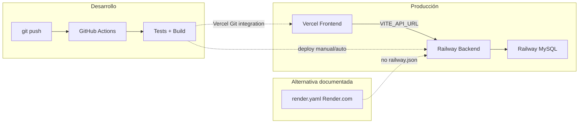

# Diagrama de Despliegue — CAFE-IA

```mermaid
flowchart LR
    subgraph Dev["Desarrollo"]
        D1[git push] --> D2[GitHub Actions]
        D2 --> D3[Tests + Build]
    end

    subgraph Prod["Producción"]
        R1[Railway Backend] --> R2[Railway MySQL]
        V1[Vercel Frontend] -->|VITE_API_URL| R1
    end

    subgraph Alt["Alternativa documentada"]
        RND[render.yaml Render.com]
    end

    D3 -.->|deploy manual/auto| R1
    D3 -.->|Vercel Git integration| V1
    RND -.->|no railway.json| R1
```
