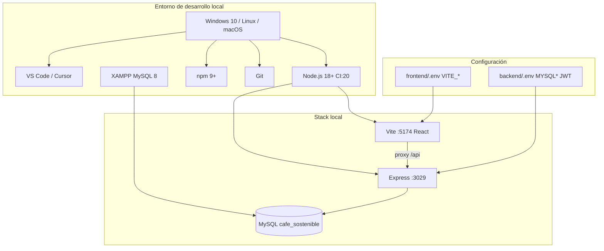

# Diagrama del Entorno — Desarrollo Local

```mermaid
flowchart TB
    subgraph Dev["Entorno de desarrollo local"]
        OS[Windows 10 / Linux / macOS]
        IDE[VS Code / Cursor]
        NODE[Node.js 18+ CI:20]
        NPM[npm 9+]
        GIT[Git]
        XAMPP[XAMPP MySQL 8]
    end

    subgraph LocalStack["Stack local"]
        FE[Vite :5174 React]
        BE[Express :3029]
        DB[(MySQL cafe_sostenible)]
    end

    subgraph Config["Configuración"]
        ENV_BE[backend/.env MYSQL* JWT]
        ENV_FE[frontend/.env VITE_*]
    end

    OS --> IDE & NODE & NPM & GIT
    NODE --> FE & BE
    XAMPP --> DB
    BE --> DB
    FE -->|proxy /api| BE
    ENV_BE --> BE
    ENV_FE --> FE
```
