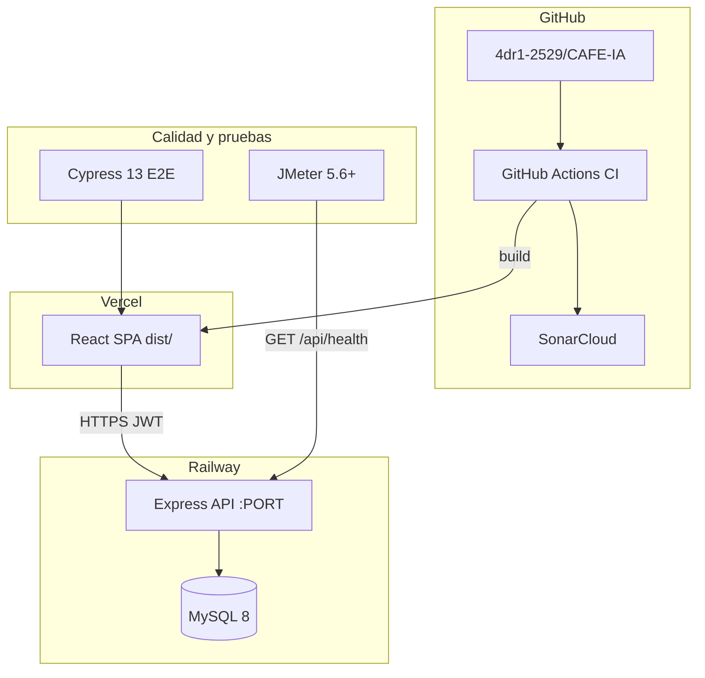

# Diagrama de Infraestructura — CAFE-IA

```mermaid
flowchart TB
    subgraph GitHub["GitHub"]
        REPO[4dr1-2529/CAFE-IA]
        GHA[GitHub Actions CI]
        SONAR[SonarCloud]
    end

    subgraph Railway["Railway"]
        API[Express API :PORT]
        MYSQL[(MySQL 8)]
    end

    subgraph Vercel["Vercel"]
        SPA[React SPA dist/]
    end

    subgraph QA["Calidad y pruebas"]
        CYP[Cypress 13 E2E]
        JMT[JMeter 5.6+]
    end

    REPO --> GHA
    GHA --> SONAR
    GHA -->|build| SPA
    API --> MYSQL
    SPA -->|HTTPS JWT| API
    CYP --> SPA
    JMT -->|GET /api/health| API
```
