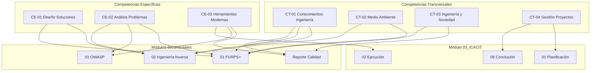

# Mapa de Competencias ICACIT — CAFE-IA

**Fecha:** 24 de junio de 2026

---

## Mapa visual

---

## Matriz competencia ↔ módulo

| Competencia | Ingeniería Inversa | FURPS+ | OWASP | Reporte Calidad | Código | Informe Final |
|-------------|-------------------|--------|-------|-----------------|--------|---------------|
| CT-01 | ☑ Pasos 04–07 | ☑ Paso 02 | — | ☑ Cap. 03–04 | ☑ backend/frontend | ☑ Cap. 12 |
| CT-02 | ☑ Paso 08 | ☑ F 83 % | — | ☑ Cap. 05 | ☑ trazabilidad | ☑ |
| CT-03 | ☑ Paso 03 | ☑ U 78 % | — | ☑ Matriz HU | ☑ RBAC | ☑ |
| CT-04 | ☑ Paso 12–13 | ☑ Paso 01 | ☑ Paso 04 | ☑ Cap. 13 | — | ☑ |
| CE-01 | ☑ Pasos 05–07 | ☑ 88 % | — | ☑ Diagramas | ☑ hexagonal | ☑ |
| CE-02 | ☑ Paso 11 | ☑ 18 FUR | ☑ 24 CON | ☑ Cap. 06–07 | ☑ hallazgos | ☑ |
| CE-03 | ☑ Paso 09–10 | ☑ Paso 02 | ☑ Paso 05 | ☑ Cap. 07–10 | ☑ testing/ | ☑ |

---

## Matriz competencia ↔ prueba

| Competencia | Cypress | JMeter | npm test | SonarQube | CI/CD |
|-------------|---------|--------|----------|-----------|-------|
| CT-01 | — | — | ☑ 18/18 | ☑ config | ☑ |
| CT-03 | ☑ 13/13 | — | — | — | — |
| CE-02 | ☑ RBAC | — | ☑ | ☑ correcciones | ☑ audit |
| CE-03 | ☑ 11 specs | ☑ 500/500 | ☑ | ☑ | ☑ Railway/Vercel |

---

*Mapa de Competencias — Paso 01 Planificación ICACIT.*
