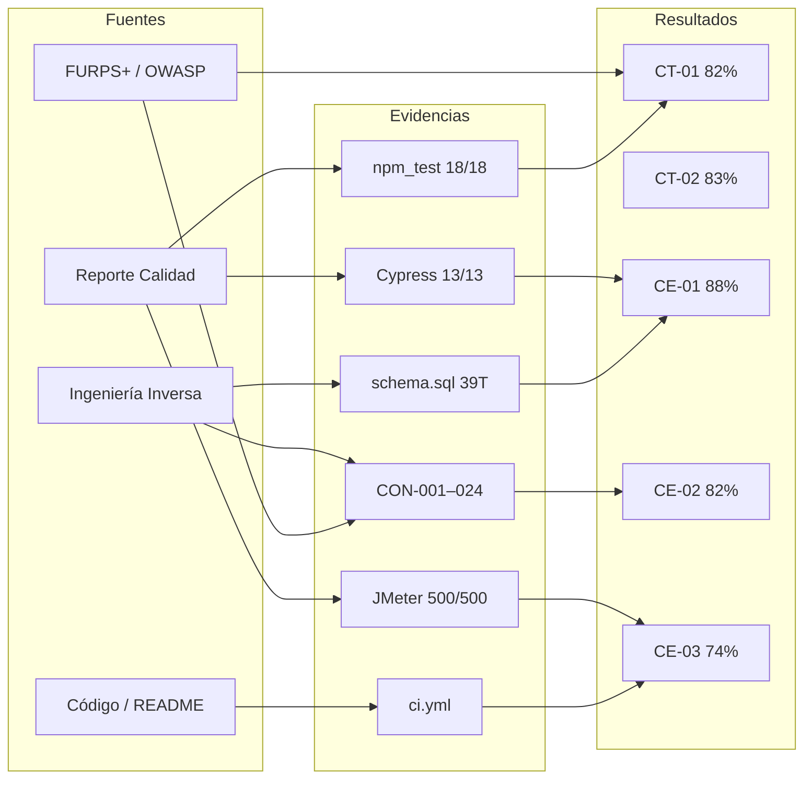

# Mapa de Evidencias — Ejecución ICACIT — CAFE-IA

**Fecha:** 24 de junio de 2026

---

## Mapa fuente → evidencia → resultado

---

## Matriz fuente documental

| Fuente | Ruta | Evidencias extraídas | Competencias |
|--------|------|---------------------|--------------|
| Ingeniería Inversa | `02_Ingenieria_Inversa/` | Arquitectura, dominio, entorno, hallazgos | CT-01, CT-02, CE-01, CE-02 |
| FURPS+ | `01_FURPS_OWASP/02-03/` | Métricas FUR, 18 hallazgos FUR | CT-01, CT-02, CE-01 |
| OWASP | `01_FURPS_OWASP/05-08/` | 76 % seguridad, 24 CON | CE-02, CE-03 |
| Reporte Calidad | `Reporte-Calidad-Software/` | Cypress, JMeter, Sonar, Postman | CE-03, CT-03 |
| README / código | `cafe-cursor/` | Stack, despliegue, APIs | CT-01, CE-01, CE-03 |
| Plan ICACIT 01 | `03_ICACIT/01_Planificacion/` | Plan, competencias, cronograma | CT-04 |

---

## Validaciones cruzadas

| Evidencia | Fuente 1 | Fuente 2 | Consistente |
|-----------|----------|----------|-------------|
| Arquitectura 88 % | FURPS/08 | II/06 | ☑ |
| Tests backend 18/18 | FURPS/03 | Reporte/04 | ☑ |
| Cypress 13/13 | Reporte/08 | FURPS evidencias | ☑ |
| 24 hallazgos | FURPS/07 | OWASP/06 | ☑ |
| Railway HTTP 200 | II/09 | README | ☑ |

---

*Mapa de Evidencias — Paso 02 Ejecución ICACIT.*
