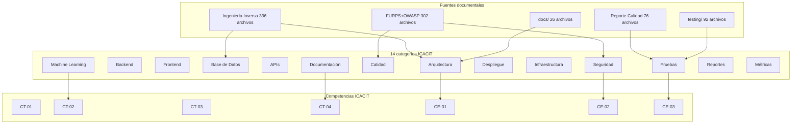

# Mapa de Evidencias — Consolidación ICACIT — CAFE-IA

**Fecha:** 24 de junio de 2026

---

---

## Rutas canónicas recomendadas (evitar duplicados)

| Tipo | Ruta canónica | Duplicados en |
|------|---------------|---------------|
| Arquitectura mmd | `docs/Arquitectura de la solución planteada/` | 10 carpetas Evidencias/ |
| Cypress results | `Reporte-Calidad-Software/Evidencias/cypress/last-run.json` | 15+ carpetas |
| npm audit backend | `Plan-de-Pruebas/01_FURPS_OWASP/07/.../npm_audit_backend.txt` | 10+ carpetas |
| DER mermaid | `docs/.../der-relaciones-completas.mmd` | 4 ubicaciones |
| JMeter | `testing/metricas/jmeter/` + `Reporte-Calidad/Evidencias/jmeter/` | 2 (equivalentes) |

---

*Mapa — Paso 03 Evidencias ICACIT.*
