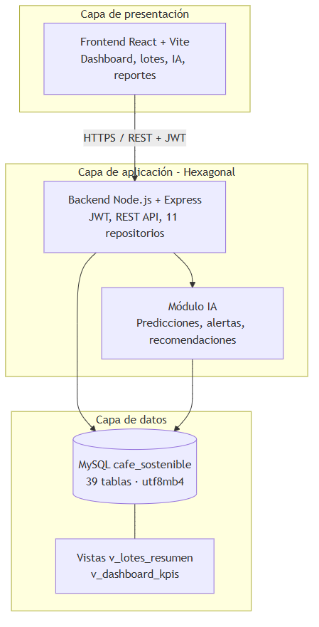
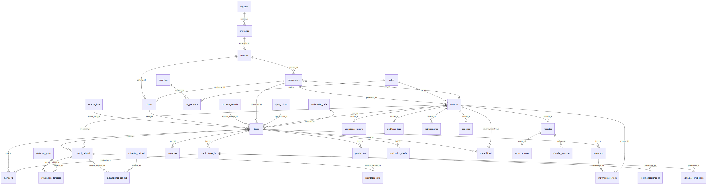

# Arquitectura de la solución planteada — CAFE-IA

> **Generado:** 2026-06-04  
> **Base de datos:** `cafe_sostenible` (39 tablas, 43 FK verificadas en MySQL)

## Diagramas

| Imagen | Descripción |
|--------|-------------|
|  | DER resumido por dominios (recomendado para tesis) |
|  | Capas: presentación, aplicación, datos |
|  | Las 43 relaciones FK entre 39 tablas |

## Regenerar

```bash
cd backend
npm run db:docs:full
```

Incluye exportación PNG a esta carpeta.
