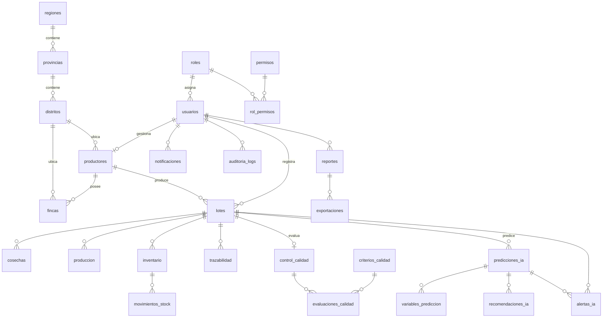
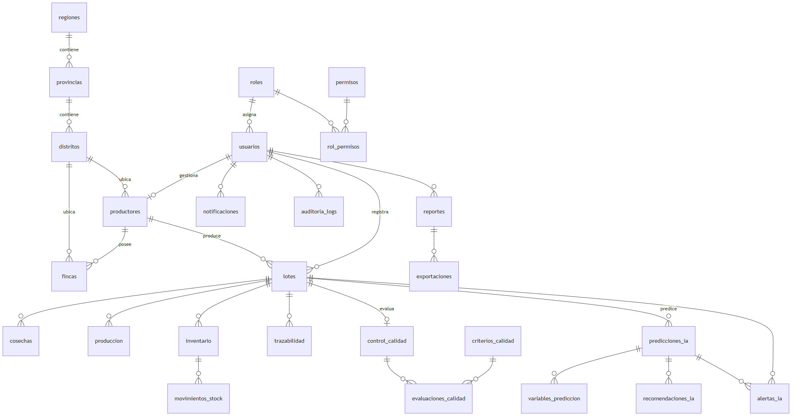

# DER por módulos — Base de datos CAFE-IA

> Generado: 2026-06-04 · MySQL `cafe_sostenible` validado

```mermaid
erDiagram
    regiones ||--o{ provincias : contiene
    provincias ||--o{ distritos : contiene
    distritos ||--o{ productores : ubica
    distritos ||--o{ fincas : ubica
    roles ||--o{ usuarios : asigna
    roles ||--o{ rol_permisos : ""
    permisos ||--o{ rol_permisos : ""
    productores ||--o{ fincas : posee
    productores ||--o{ lotes : produce
    usuarios ||--o{ lotes : registra
    usuarios ||--o| productores : gestiona
    lotes ||--o{ cosechas : ""
    lotes ||--o{ produccion : ""
    lotes ||--o{ inventario : ""
    inventario ||--o{ movimientos_stock : ""
    lotes ||--o{ trazabilidad : ""
    lotes ||--o| control_calidad : evalua
    control_calidad ||--o{ evaluaciones_calidad : ""
    criterios_calidad ||--o{ evaluaciones_calidad : ""
    lotes ||--o{ predicciones_ia : predice
    predicciones_ia ||--o{ variables_prediccion : ""
    predicciones_ia ||--o{ recomendaciones_ia : ""
    predicciones_ia ||--o{ alertas_ia : ""
    lotes ||--o{ alertas_ia : ""
    usuarios ||--o{ reportes : ""
    reportes ||--o{ exportaciones : ""
    usuarios ||--o{ notificaciones : ""
    usuarios ||--o{ auditoria_logs : ""
```

