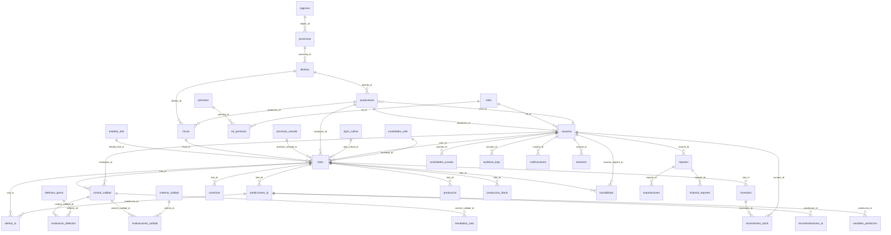

# Diagrama Entidad-Relación (DER) — Café Sostenible AI

> **Fuente:** MySQL en vivo (`cafe_sostenible`) + `backend/sql/schema.sql`  
> **Generado:** 2026-06-04 (script `npm run db:docs`)

---

## DER global

## Entidades

- `regiones`
- `provincias`
- `distritos`
- `roles`
- `permisos`
- `rol_permisos`
- `usuarios`
- `sesiones`
- `auditoria_logs`
- `productores`
- `fincas`
- `variedades_cafe`
- `tipos_cultivo`
- `procesos_secado`
- `estados_lote`
- `lotes`
- `cosechas`
- `produccion`
- `produccion_diaria`
- `inventario`
- `movimientos_stock`
- `trazabilidad`
- `criterios_calidad`
- `control_calidad`
- `evaluaciones_calidad`
- `defectos_grano`
- `evaluacion_defectos`
- `resultados_cata`
- `predicciones_ia`
- `variables_prediccion`
- `alertas_ia`
- `recomendaciones_ia`
- `reportes`
- `exportaciones`
- `historial_reportes`
- `notificaciones`
- `configuraciones`
- `actividades_usuario`
- `dashboard_metricas`

## Imágenes exportadas

Ver carpeta [`../Arquitectura de la solución planteada/`](../Arquitectura%20de%20la%20solución%20planteada/).
